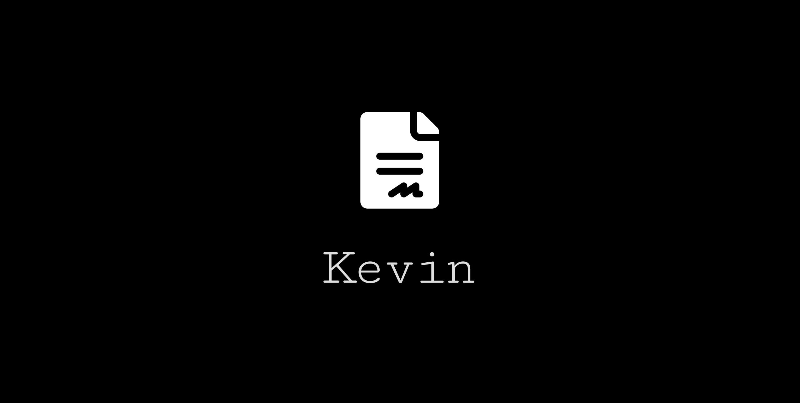

<p align="center">
  
</p>

<h1 align="center">Kevin</h1>
<p align="center"><strong>Your AI legal sidekick</strong></p>

<p align="center">
  <a href="LICENSE"></a>
  <a href="CHANGELOG.md"></a>
  
  
  
  <a href="https://github.com/openclaw/clawhub"></a>
</p>

<p align="center">
  A Claude skill that handles contracts, compliance, privacy, IP, and security for AI startups.<br/>
  10 structured workflows. 2,400+ lines of legal knowledge. One command to install.
</p>

---

## Why Kevin?

AI startups face real legal risk — the EU AI Act high-risk deadline hits **August 2026**, Colorado's AI Act goes live **June 2026**, and enterprise customers are demanding compliance documentation today. Enterprise legal tools cost $500–5,000+/month. Most founders end up copy-pasting templates from Google and hoping for the best.

Kevin gives you the same analytical framework a specialized AI lawyer would use, for free, inside the tool you're already coding in.

Kevin is not a lawyer. He's the tireless paralegal who makes sure you don't ship a product into a legal minefield.

## What Kevin Does

Kevin handles the ten legal workflows AI startups encounter most:

| # | Workflow | What You Get |
|---|---|---|
| 1 | **AI Vendor Contract Review** | Redlined contract + 18-point gap analysis + negotiation strategy |
| 2 | **EU AI Act Risk Classification** | Risk tier classification + compliance obligation map + remediation plan |
| 3 | **Data Processing Addendum (DPA)** | Complete DPA with AI-specific provisions (no-training, zero-retention, bias testing) |
| 4 | **Internal AI Use Policy** | Employee policy + data classification matrix + training curriculum |
| 5 | **AI Privacy Notice** | GDPR/CCPA/AI Act-compliant privacy notice with AI disclosure section |
| 6 | **AI Threat Model Assessment** | 18-threat risk register with scores, mitigations, and residual risk acceptance |
| 7 | **Enterprise Due Diligence Response** | Completed questionnaire + supporting documentation package |
| 8 | **AI Intellectual Property Audit** | IP inventory + rights chain analysis + training data audit |
| 9 | **AI Incident Response** | Incident classification + notification matrix + post-incident review |
| 10 | **Regulatory Change Impact Analysis** | Gap analysis + impact assessment + phased remediation roadmap |

## Regulatory Coverage

Kevin tracks and applies:

- **EU AI Act** (Reg. 2024/1689) — risk classification, prohibited practices, GPAI obligations, conformity assessments
- **Colorado AI Act (CAIA)** — consequential decisions, algorithmic discrimination, impact assessments
- **GDPR** — data processing, automated decision-making (Art. 22), DPIAs, international transfers
- **CCPA/CPRA** — service provider obligations, opt-out rights, automated decision-making
- **NIST AI RMF 1.0** — GOVERN, MAP, MEASURE, MANAGE functions
- **OWASP Top 10 for LLMs** — security threat taxonomy
- US state patchwork (Illinois BIPA, NYC Local Law 144, and others)
- International frameworks (UK, Canada, Brazil, China, Dubai/DIFC)

## Installation

### Claude Code (CLI)

Download `kevin.skill` from the [Releases](../../releases) page, then:

```bash
claude install-skill kevin.skill
```

That's it. Kevin will automatically activate whenever you ask Claude a legal question about AI.

### Claude Cowork (Desktop)

1. Download the `kevin.skill` file from the [Releases](../../releases) page
2. Open Claude Desktop → Cowork mode
3. Drop the `kevin.skill` file into the chat, or install it from the skill browser

Kevin will appear in your available skills and activate automatically when you ask legal questions.

### ClawHub (OpenClaw)

If you use [OpenClaw](https://docs.openclaw.ai/tools/skills), Kevin is published on [ClawHub](https://github.com/openclaw/clawhub):

```bash
clawhub install kevin
```

### Manual install

```bash
# Clone the repo
git clone https://github.com/kcass16/kevin.git

# Copy into your project's skills directory
cp -r kevin/ /path/to/your-project/.claude/skills/kevin
```

Or add as a git submodule:

```bash
cd your-project
git submodule add https://github.com/kcass16/kevin.git .claude/skills/kevin
```

## Usage Examples

Once installed, just talk to Claude naturally. Kevin activates automatically.

### Review a vendor contract

```
Review this AI vendor contract and flag any issues.
[attach contract PDF or paste text]
```

Kevin will run the 18-point gap analysis, score each element, generate redlines, and produce a negotiation strategy memo.

### Classify your AI system

```
We're building a resume screening tool that ranks job applicants.
What's our risk classification under the EU AI Act?
```

Kevin will run the prohibited practice screen, Annex III high-risk classification, CAIA assessment, and produce a compliance obligation map with deadlines.

### Draft an internal AI policy

```
We need an AI acceptable use policy for our 30-person startup.
We use Claude for coding and ChatGPT for marketing content.
```

Kevin will create a complete policy with data classification matrix, approved tool guidance, mandatory rules, and training requirements.

### Quick legal questions

```
Can our AI vendor use our customer data to train their models?
```

Kevin will explain the legal position, cite the relevant regulations, and provide model contract language to prevent it.

### AI incident response

```
We discovered that our AI chatbot leaked a customer's email address
to another user. What do we need to do?
```

Kevin will classify the incident, map all notification obligations with timelines, and draft the required notifications.

## Project Structure

```
kevin/
├── SKILL.md                              # Core skill file (loaded into context on trigger)
│                                         #   → Kevin's personality, workflow router, quick references,
│                                         #     model contract clauses, risk framework
│
├── references/
│   ├── knowledge-base.md                 # Deep legal knowledge base (875 lines)
│   │                                     #   → Regulatory landscape, contract playbook, privacy
│   │                                     #     frameworks, threat model, governance, IP, insurance,
│   │                                     #     compliance checklists, operating principles
│   │
│   └── workflows.md                      # Structured workflow engine (1,536 lines)
│                                         #   → 10 workflows, each with: trigger, inputs, legal
│                                         #     framework, step-by-step process, outputs, validation
│                                         #     criteria, escalation triggers
│
├── assets/                               # Logo, social preview, screenshots
├── README.md                             # This file
├── CODE_OF_CONDUCT.md                    # Contributor Covenant v2.1
├── SECURITY.md                           # Security policy & responsible disclosure
├── CONTRIBUTING.md                       # How to contribute
├── CHANGELOG.md                          # Version history
├── CLAUDE.md                             # Repo guide for Claude (how to make changes)
├── LICENSE                               # MIT License
└── kevin.skill                           # Packaged skill for one-command installation
```

### How the skill loads

Claude uses a progressive disclosure model for skills:

1. **Always in context:** The skill `name` and `description` from SKILL.md frontmatter (~100 words). This is what tells Claude when to activate Kevin.
2. **On trigger:** The full SKILL.md body (~300 lines). This gives Kevin his personality, workflow selection table, contract checklist, regulatory quick references, model clauses, and threat model summary.
3. **On demand:** The reference files are read only when Kevin needs deeper detail for a specific workflow or question. This keeps context lean for simple questions while making the full knowledge base available for heavy-duty work.

## Key Regulatory Deadlines (2025–2027)

| Date | Event | Status |
|---|---|---|
| Feb 2, 2025 | EU AI Act: Prohibited practices banned | Done |
| Aug 2, 2025 | EU AI Act: GPAI obligations effective | Done |
| Jun 30, 2026 | Colorado AI Act (CAIA) effective | **Prepare Now** |
| Aug 2, 2026 | EU AI Act: High-risk system requirements enforceable | **Prepare Now** |
| Dec 2, 2027 | EU AI Act: Potential extension (Digital Omnibus) | Watch |

## What Kevin Does NOT Do

- Provide formal legal opinions or attorney-client privileged advice
- Represent you in court or regulatory proceedings
- Make final decisions on legal strategy
- Replace jurisdiction-specific counsel for high-stakes matters
- Guarantee regulatory compliance

Kevin always includes this disclaimer when starting substantive legal work:

> *"I'm Kevin, your AI legal sidekick — not a licensed attorney. This guidance is informational. For binding legal decisions, consult qualified counsel in your jurisdiction."*

## Customization

### Adapting Kevin for your startup

Kevin is designed as a general-purpose AI legal skill, but you can customize him for your specific situation:

1. **Add your standard contracts:** Place your AI addendum template, DPA, or terms of service in the `references/` directory and update SKILL.md to reference them.

2. **Add jurisdiction-specific rules:** If you operate primarily in a specific jurisdiction (e.g., Germany, Singapore, Brazil), add a `references/local-law.md` with jurisdiction-specific requirements and update the workflow framework references.

3. **Add your company policy:** Drop your internal AI governance policy into `references/` so Kevin can reference it when answering employee questions or doing contract reviews against your standards.

4. **Tune the risk scoring:** Adjust the risk matrix in SKILL.md if your organization has a different risk appetite (e.g., a healthcare AI startup might set all data-related threats to CRITICAL by default).

### Extending with new workflows

To add a new workflow:

1. Add the workflow to `references/workflows.md` following the existing structure (Trigger → Input → Legal Framework → Process → Output → Validation → Escalation)
2. Add a row to the workflow selection table in SKILL.md
3. Add any new legal knowledge to `references/knowledge-base.md`

## Requirements

- **Claude Code** (CLI), **Claude Cowork** (Desktop), or any Claude-powered environment that supports skills
- No external dependencies, API keys, or databases required
- Kevin works entirely within Claude's context — no network calls, no data leaves the conversation

## Contributing

Contributions are welcome, especially:

- **Regulatory updates** — New AI laws, amendments, enforcement actions, court decisions
- **Contract clause improvements** — Battle-tested language from real negotiations
- **New workflows** — Common legal tasks not yet covered
- **Jurisdiction expansions** — Country-specific legal requirements and addenda
- **Threat model updates** — New AI-specific attack vectors and mitigations

See [CONTRIBUTING.md](CONTRIBUTING.md) for the full guide and style rules.

## License

MIT License. See [LICENSE](LICENSE) for details.

Kevin's output is informational guidance, not legal advice. Use at your own risk and always consult qualified legal counsel for binding decisions.

## Disclaimer

Kevin is an AI-powered legal information tool. It is not a law firm, does not provide legal advice, and does not establish an attorney-client relationship. The information provided by Kevin is for general informational purposes only and may not reflect the most current legal developments. Laws and regulations change frequently, and the application of laws can vary widely based on specific facts and circumstances. You should consult with a qualified attorney in your jurisdiction for advice on any specific legal matter.

---

<p align="center">Built for founders who'd rather ship product than read regulatory footnotes.</p>
